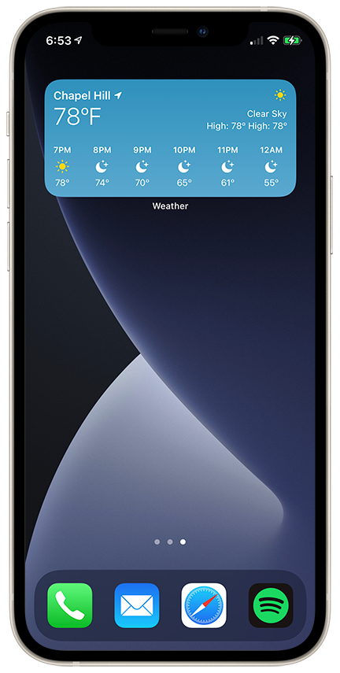

# Weather-Recreation

  
  

## Description

- Recreated the native iOS 14 Weather app to explore new technologies.
- Built an iOS 14 widget with WidgetKit and Intents to show weather data for current or specified location.
- Used CoreLocation to get the user's current location and MapKit to search for cities.
- Utilized JSON/REST APIs and URLSession to fetch future and current weather data.

## Technologies Used

- SwiftUI
- Swift
-  WidgetKit
- CoreLocation
- MapKit
- FileManager
- URLSession
- Codable
