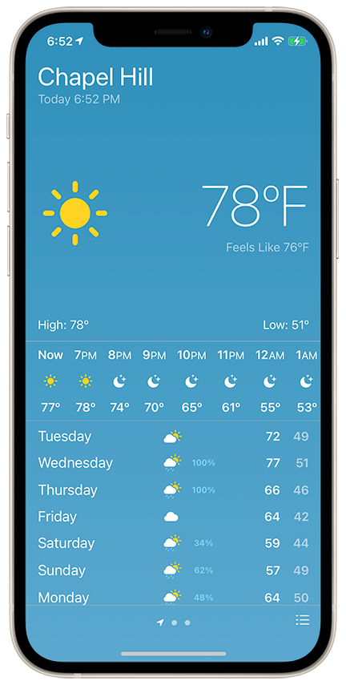
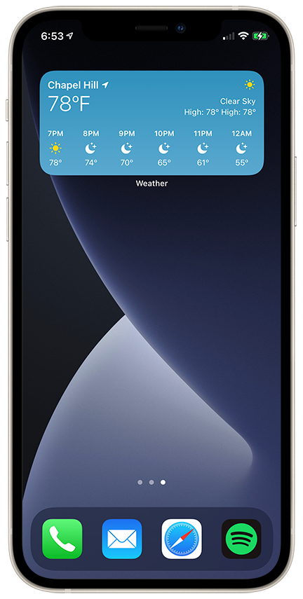

# Weather-Recreation
| Photo 1 | Photo 2 | Description |
| ---- | ---- | ---- |
|  |  | I recreated the iOS Weather application as an exploration of new technologies.   Technologies used: - SwiftUI  - Swift  -  WidgetKit  - CoreLocation  - MapKit  - FileManager - URLSession - Codable|
